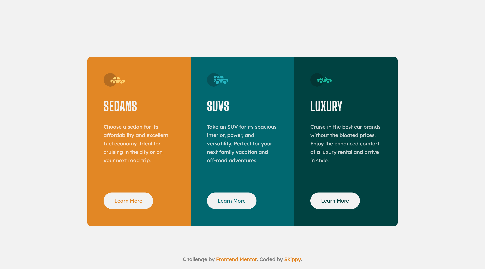

# Frontend Mentor - 3-column preview card component solution

This is a solution to the [3-column preview card component challenge on Frontend Mentor](https://www.frontendmentor.io/challenges/3column-preview-card-component-pH92eAR2-). Frontend Mentor challenges help you improve your coding skills by building realistic projects.

## Table of contents

- [Overview](#overview)
  - [The challenge](#the-challenge)
  - [Screenshot](#screenshot)
  - [Links](#links)
- [My process](#my-process)
  - [Built with](#built-with)
  - [Useful resources](#useful-resources)
- [Author](#author)

## Overview

### The challenge

Users should be able to:

- View the optimal layout depending on their device's screen size
- See hover states for interactive elements

### Screenshot

### Links

- Solution URL: [Frontend Mentor]()
- Live Site URL: [Github Pages](https://skippysworld.github.io/3-Column-Preview-Card-Component/)

## My process

### Built with

- Semantic HTML5 markup
- CSS custom properties
- Flexbox

### Useful resources

- [A modern CSS Reset](https://piccalil.li/blog/a-modern-css-reset/) - I heard about CSS Reset templates during my online course.. There is a lot of options out there, but I've decided to start with this one. back on this project in the future.\*\*

## Author

- Frontend Mentor - [@skippysworld](https://www.frontendmentor.io/profile/skippysworld)
